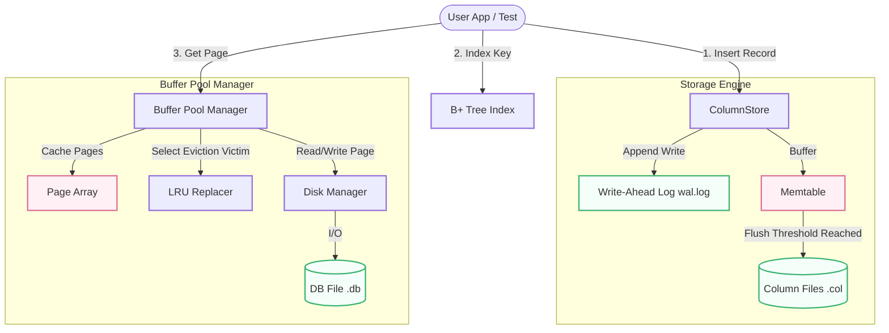

# MiniDB 

MiniDB is a lightweight educational database engine built from scratch in Python to demonstrate the core internals of modern database systems. The project implements a columnar storage engine, write-ahead logging (WAL) for durability, a buffer pool manager for caching disk pages, and a B+ Tree index for efficient data retrieval.

The system allows users to store, query, and manage structured data while simulating how real database engines handle storage, indexing, caching, and crash recovery.

---

##  Architecture Overview

The system consists of three primary modules:
1. **Buffer Pool Manager**: Manages page cache between disk and memory.
2. **B+ Tree Index**: Provides fast key-value lookups with balanced search tree logic.
3. **Columnar Storage**: Stores data column-by-column, incorporating a Write-Ahead Log (WAL) and memtable flushing mechanism.

### System Components & Data Flow



---

##  Features & Usage

### 1. Columnar Storage & WAL Recovery
The `ColumnStore` saves table attributes in separate column files (e.g., `id.col`, `name.col`, etc.). This optimization is ideal for analytical workloads (OLAP). It also ensures durability via a Write-Ahead Log (WAL).

#### How to use:
```python
from storage import ColumnStore

# Initialize the column store
db = ColumnStore(data_dir="./data")

# Insert data (appends to WAL immediately, buffers to memtable)
db.insert({"id": 1, "name": "Alice", "age": 30, "salary": 5000})
db.insert({"id": 2, "name": "Bob", "age": 25, "salary": 6000})

# On startup / instantiation, any un-flushed data in WAL is recovered automatically
recovered_db = ColumnStore(data_dir="./data")
```

### 2. Buffer Pool Manager
The `BufferPoolManager` acts as a cache between the disk and memory. It fetches pages, pins them while in use, and flushes dirty pages to the disk via the `DiskManager` when evicted.

#### How to use:
```python
from buffer import DiskManager, BufferPoolManager

# Setup Disk Manager and Buffer Pool Manager
disk_mgr = DiskManager("data/db_file.db")
bpm = BufferPoolManager(pool_size=3, disk_manager=disk_mgr)

# Create a new page
page = bpm.new_page()
print(f"Allocated Page ID: {page.page_id}")

# Write binary data to the page
page.data[:12] = b"Hello MiniDB"

# Unpin page and mark as dirty (needs to be written to disk)
bpm.unpin_page(page.page_id, is_dirty=True)

# Fetch page back (if evicted, it reads from disk)
fetched_page = bpm.fetch_page(page.page_id)
print(fetched_page.data[:12].decode())
```

### 3. B+ Tree Index
The `BPlusTree` provides logarithmic time complexity ($O(\log N)$) search, insert, and range queries. It splits nodes as they exceed their designated order capacity.

#### How to use:
```python
from index import BPlusTree

# Initialize B+ Tree with node order of 3
tree = BPlusTree(order=3)

# Insert keys and values
tree.insert(10, "Row Pointer 1")
tree.insert(20, "Row Pointer 2")
tree.insert(5, "Row Pointer 3")

# Fast search
result = tree.find(20)
print(f"Found: {result}") # Output: Row Pointer 2
```

---

##  Testing & Benchmarks

The project comes with a unit test suite to test all components. 

### Running Tests
Execute the test runner using Python's built-in `unittest` module:
```bash
python3 -m unittest discover -s tests
```

### Running the B+ Tree Benchmark
To compare the lookup performance of the B+ Tree index against a sequential scan on 100,000 records, run the benchmark script:
```bash
PYTHONPATH=. python3 tests/bplus_test.py
```